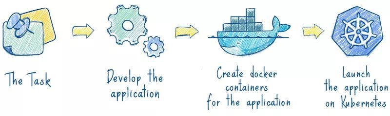

#### 为什么使用Kubernetes？

Kubernetes 已经越来越流行，已经成为当前市场上最好的容器编排工具之一。

### 1. 什么是容器？

容器就是一个包，其中包含了应用及其所有依赖。

容器中的应用与主机系统是隔离的，不关注环境。

不像虚拟机，容器不需要启动操作系统的完整周期，这就是为啥容器启动和停止都非常快，并且可以更高效使用磁盘、内存、处理器的原因。

你不必记着你的应用是用什么语言和框架开发的，因为所需的一切都打包在了容器中，例如运行时环境、所需的库等等，可以安全的迁移，可以在任何环境中部署。

左侧，应用是直接部署在物理服务器或者虚拟机里面的；与传统方式不同的是，在右侧容器化基础架构中的应用都打包在一个独立的容器中的，这意味着它们可以在任何环境下更快速地启动、智能扩展和更流畅地运行。

### 2.什么是 Kubernetes？

Kubernetes 是一个开源项目，用于统一管理容器化的应用集群。

Kubernetes 负责在大规模服务器环境中管理容器组（pod）的扩展、复制、健康，并解决 pod 的启动、[负载均衡](https://cloud.tencent.com/product/clb?from=10680)等问题。

Kubernetes 最初是 Google 发布的，现在已经被多家大公司支持，例如 Microsoft, RedHat, IBM, Docker。

在以后应程序编写时，最好一开始就考虑微服务方式。否则，一旦应用被写成一个单体程序，将来很难将其进行容器化。

让我们快速浏览一下Kubernetes与虚拟机相比的一些最显着优势：

#### 2.1 一个平台搞定所有

使用 Kubernetes，部署任何应用都是小菜一碟。

只要应用可以打包进容器，Kubernetes 就一定能启动它。

不管什么语言什么框架写的应用（Java, Python, Node.js等），Kubernetes 都可以在任何环境中安全的启动它，不论是物理服务器、虚拟机或者云环境。

#### 2.2 云环境无缝迁移

如果你有换云环境的需求，例如从 GCP 到 AWS，使用 Kubernetes 的话，你就不用有任何担心。

Kubernetes 完全兼容各种云服务提供商，例如 Google Cloud、Amazon、Microsoft Azure，还可以工作在  CloudStack, OpenStack, OVirt, Photon, VSphere。

#### 2.3 高效的资源利用

看下图，左边，是4个虚拟机，黄色和蓝色部分是运行的应用，白色部分是未使用的内存和处理器资源。

右边，同样的应用打包运行在容器中。是否发现它们之间的差异？

从上图看，Kubernetes帮助节省成本并有效利用内存和处理器资源

Kubernetes 如果发现有节点工作不饱和，便会重新分配 pod，帮助我们节省开销，高效的利用内存、处理器等资源。

如果一个节点宕机了，Kubernetes 会自动重新创建之前运行在此节点上的 pod，在其他节点上运行。

#### 2.4 开箱即用的自动伸缩能力

网络、负载均衡、复制等特性，对于 Kubernetes 都是开箱即用的。

pod 是无状态运行的，任何时候有 pod 宕了，立马会有其他 pod 接替它的工作，用户完全感觉不到。

如果用户量突然暴增，现有的 pod 规模不足了，那么会自动创建出一批新的 pod，以适应当前的需求。

反之亦然，当负载降下来的时候，Kubernetes 也会自动缩减 pod 的数量。

Kubernetes增强了应用的可扩展性，确保它在关键时刻不会崩溃。

#### 2.5 使 CI/CD 更加简单

Kubernetes使得CI/CD过程更加简单了，你不必精通于 Chef 和 Ansible 这类工具，只需要对 CI 服务写个简单的脚本然后运行它，就会使用你的代码创建一个新的 pod，并部署到 Kubernetes 集群里面。应用打包在容器中使其可以安全的运行在任何地方，例如你的 PC、一个云服务器，使得测试极其简单。

#### 2.6 可靠性

Kubernetes 如此流行的一个重要原因是：应用会一直平稳运行，不会被 pod 或 节点的故障所中断。

如果出现故障，Kubernetes 会创建必要数量的应用镜像，并重新分配到健康的 pod 或节点中，直到系统恢复。

而且用户不会感到任何不适。

一个容器化的基础设施是有自愈能力的，可以提供应用程序的不间断操作，即使一部分基础设施出现故障。

### 3. 总结

Kubernetes 使得应用的启动、迁移、部署变得即简单又安全。

不必担心应用迁移后工作出现问题，也不用担心一台服务器无法应付突发的用户量。

需要注意的是，你的应用最好使用微服务架构进行开发，因为微服务应用比单体应用更适合做容器化。

参考链接：https://yellow.systems/blog/why-you-should-use-kubernetes-in-your-next-project

