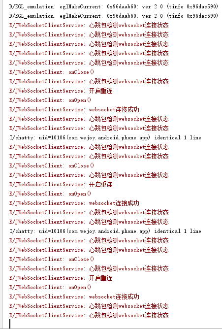
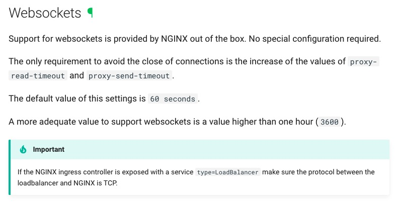

解决ingress发布websocket长连接服务超时问题


#### 场景描述

在Kubernetes环境中部署的websocket服务是一个长连接服务，在测试环境中发现连接会随机中断，测试如下图



#### 解决方法



根据官方文档描述，需要调整proxy-read-timeout和proxy-send-timeout时间设置超过3600,具体在yaml文件中添加或调整如下：

```bash
   nginx.ingress.kubernetes.io/proxy-read-timeout: "4800"
   nginx.ingress.kubernetes.io/proxy-send-timeout: "4800"
   nginx.ingress.kubernetes.io/websocket-services: CHANGE_TO_YOUR_SERVICE
```

调整过后，测试效果如下图：


#### 注意事项

如果在ingress前面还有LB的场景中，LB的超时时间也好改成大于3600的设置值。


#### 参考

https://kubernetes.github.io/ingress-nginx/user-guide/miscellaneous/#websockets