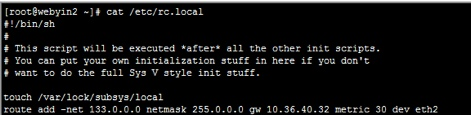

### 【应用场景】

配置服务器时经常遇到联通内网网的业务，实例如下：

|网络|IP地址|子网掩码|网关|
|---|-----|-------|----|
|外网|10.36.40.24|255.255.255.128|10.36.40.32|
|内网|172.15.7.12|255.255.255.0|172.15.7.254|

### 【配置方法】

内网网卡不指定默认网关，外网网卡指定默认网关，之后增加内网路由，则配置完成后内外网都可使用

**1.配置内网网卡**

**2.配置外网网卡**

**3.查看路由发现默认网关为外网网关，此时外网可以自由联通**

**4.添加内网路由后内网也可自由使用了**

**5.将路由写入rc.local文件，则系统启动后会自动添加路由**

**6.在/etc/sysconfig/networking/profiles/default目录下写入路由文件则不管什么时候都能自动添加路由**

